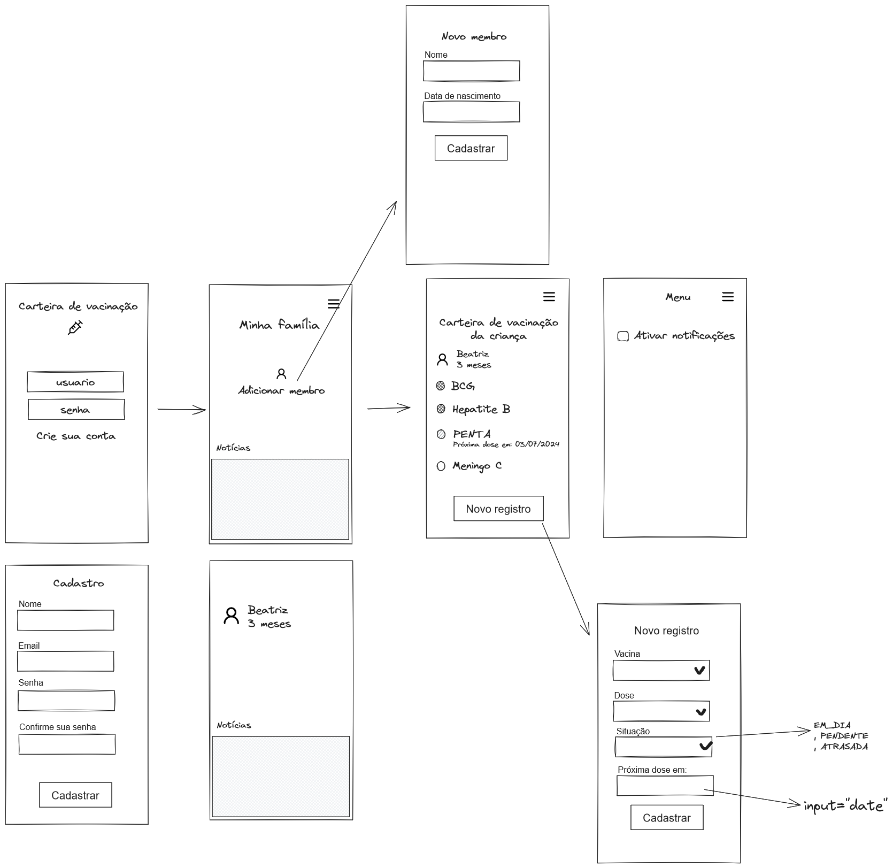
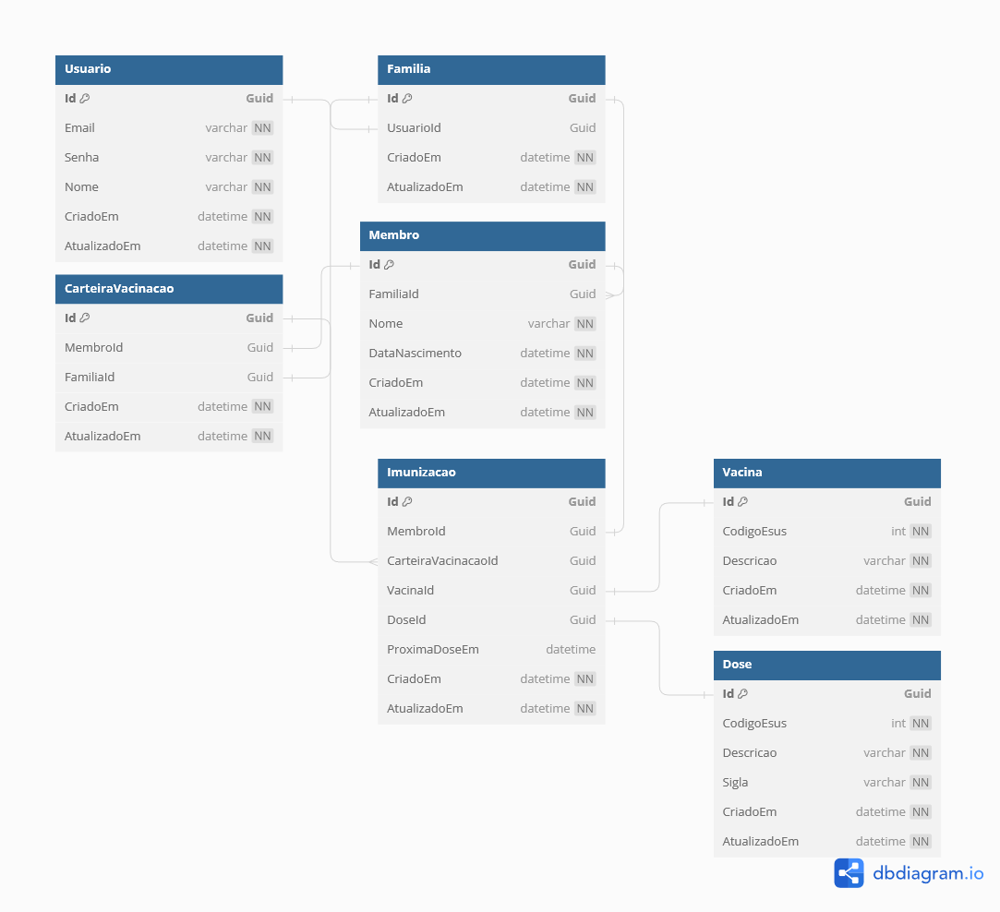

# Projeto Integrador: Desenvolvimento de Sistema Orientado a Dispositivos Móveis e baseados na Web

# Objetivo
O desenvolvimento de um aplicativo de manutenção e gerenciamento de vacinas tem como finalidade fornecer uma solução inovadora e acessível para ajudar adultos e idosos a manter suas vacinas atualizadas. Sua missão é simplificar e agilizar a consulta do histórico de vacinação e a comunicação de novidades e atualizações do calendário de vacinação para a sociedade. Facilitar o acesso a essas informações ajuda a proteger a saúde e o bem-estar dos usuários e contribui com a prevenção de doenças.

# Trilha

- [ ] Cadastrar usuário
- [ ] Registrar membros em família
- [ ] Editar membro de família
- [ ] Deletar membro de família
- [ ] Cadastrar vacina
- [ ] Atualizar registro de vacina
- [ ] Deletar registro de vacina
- [ ] Adicionar área de novidades
- [ ] Adicionar funcionalidade de notificação
  
# Protótipo

# Esquema banco de dados

# Tecnologias
- .NET 8

# Ferramentas utilizadas
- Figma
- Google Drive
- Whatsapp
- dbdiagram.io
